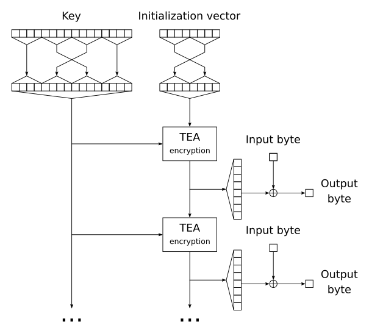

TweetTEA
========

File encryption tool, that fits in 139 characters:

```
#define M (*l)[1&p
_;main(int p,int**l){for(l++;read(0,&_,1);putchar(_^M]))for(p=1;p++<65;)M^1]+=M]*16+M^2]^M]+p/2*0x9e3779b9^M]/32u+M^4];}
```

It implements the [TEA](https://en.wikipedia.org/wiki/Tiny_Encryption_Algorithm) encryption algorithm in the [OFB](https://en.wikipedia.org/wiki/Output_feedback) mode. See an [equivalent](equivalent.c) programm in readable C.



Build
-----

```
$ gcc main.c
```

Tested on 64- and 32-bit x86 Linux.

Use
---

```
$ ./a.out "IIIIIIIIKKKKKKKKKKKKKKKK" < file.txt > encrypted.bin
```

Where `IIIIIIII` is the initialization vector and `KKKKKKKKKKKKKKKK` is the key.

Decrypt with the same command.

Links
-----

* [Source code](https://github.com/Kleshni/TweetTEA/archive/master.zip).
* [Git repository](https://github.com/Kleshni/TweetTEA.git).
* [Issue tracker](https://github.com/Kleshni/TweetTEA/issues).
* Bitmessage: BM-2cT5WWccBgLsHTw5ADLcodTz4dbqdtrwrQ.
* Mail: [kleshni@protonmail.ch](mailto:kleshni@protonmail.ch).
